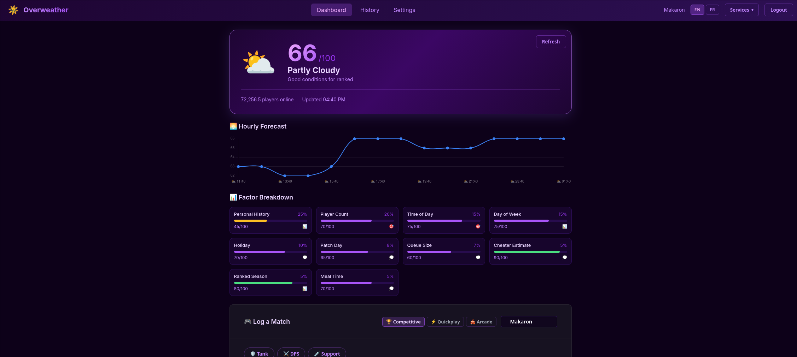
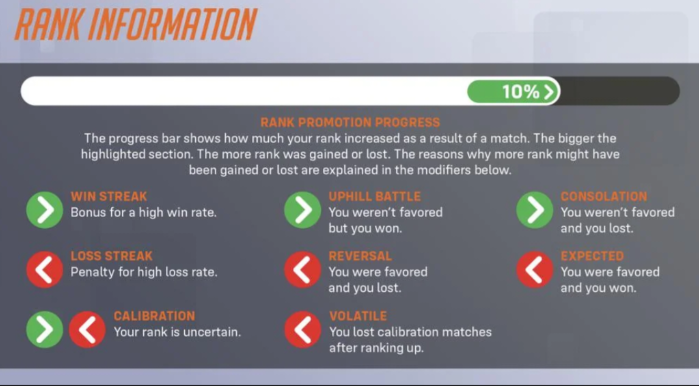

# What even is this project?

Originally, the goal was to found out what the matchmaking is really doing to users/players of OW, because, well... We do see here and there people saying something is wrong and they just get brushed off. But then I got to this [post](https://us.forums.blizzard.com/en/overwatch/t/meet-your-matchmaker-and-the-implications/973695) (which I have kept a copy just in case in this deadletter folder).

I am no statistician, nor a mathematician, but I am a programmer so I got to work on a good proof of concept of a weather like app, telling users when it is best to play the game because my initial bias was that maybe, just maybe, the matchmaking _was_ doing its job. After all, [they did put some spotlight of some of its inner workings in this interview](https://www.youtube.com/watch?v=d_Ut8pCH9QM), and they did make this post last year. They can't be proud of something that isn't working perfectly, right?

## First tries using the parameter based approach

The concept got up pretty quickly and I had this:

Each parameter, especially the personal history, made it so I could figure out a weather score. And at first, it seemed rather promising but... Something felt off. So I've added a match saving feature. And then that's when it occured to me: accross two accounts, out of a sample of 166 matches, I've got a win rate of 48%, even when playing when the "weather" was at >70 out of 100. True, the sample rate is small, but this means that logically, the winrate didn't move.

## The 20% doomed matches

Back to the post of Skund, in Competitive mode, the absolute lowest win rate probability a team encounters is 40%, and only 80% of Competitive Role Queue matches fall within the 45–55% range.
But what about the leftover 20%? Well, either it's doomed matches or... Whatever else the system is preparing for you. Which led me to another remark.

## The system tags

Now, these tags show up at the end of a match:

And this is where it clicked to me at least, the matches are tools to control your MMR, not your skill. Matches are prepared in advance with a corresponding tag, with speed in mind, not quality (at least, not for you). Meaning, a favored match is, well, favored: it is prepared for you to win.

Also, this means the system has become quite sophisticated, at least on my two accounts: I've never seen any Reversal in months. So it means that the matchmaking can prepare matches just so right, that I never needs to tell the user "oh well, I've prepared a win for you and you threw it away".

If this is true, this would make all sense: you cannot "fight" the matchmaking with a weather system that tries to figure out what user count is needed to give the user a good quality match, you can only pray.

## Next steps

Play Deadlock.
No, seriously now, I am still unsure of what I've really found. But on one thing that I'm sure is: people aren't what makes the matchmaking (or the game itself) bad and tags are the way to crack the code. My sample is simply too small, but I don't have the sanity to search further, nor the friends to play the game with to experiment.
